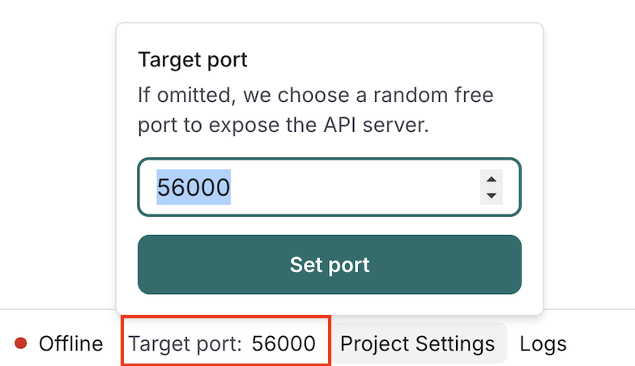
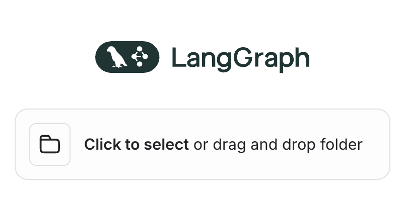

# OnCall NetOps 🚀

In this repository, you can find the code for a **Langgraph-based** agents that collaborates to diagnose network issues.

It’s part of a larger demo using a _TIG stack_ for monitoring and alerts, along a **pyATS server** to interact with the network devices.

To view the rest of the components:

- Full demo: <https://github.com/jillesca/oncall-netops-tig-pyats-demo>
- pyATS Server: <https://github.com/jillesca/pyats_server>
- Observablity stack: <https://github.com/jillesca/observablity_tig>

## Graph ⚙️

When receiving a request, the `node_coordinator` **validates** the info provided,
then passes it to the `node_orchestrator`, which **decides** which network agents to call. Each agent connects to devices, gathers data, and returns a report.

Network agents:

- `agent_isis`
  - Retrieves ISIS info.
- `agent_routing`
  - Retrieves routing info.
- `agent_log_analyzer`
  - Checks logs.
- `agent_device_health`
  - Retrieves device health.
- `agent_network_interface`
  - Retrieves interfaces/config.
- `agent_interface_actions`
  - Performs interface actions.

When all agents finish, their reports go to the `node_root_cause_analyzer`, which **determines** the root cause. If more info is needed, it requests it from the `node_orchestrator`. Otherwise, final findings go to the `node_report_generator`.


Short memory is implemented (per thread) that lets agents recall past investigations to resume work, so users can ask about events.

## Requirements ⚠️

- **Python 3.11** (Only for the _Langgraph Studio Desktop_ version).
- **OpenAI Key**.
- **Langsmith Key,** [Create a token](https://docs.smith.langchain.com/administration/how_to_guides/organization_management/create_account_api_key) and copy the langsmith env vars.
- **pyATS Server URL**.

Create an `.env` file and set your keys there.

<details>
<summary> Click here to see an example of the .env file </summary>

```bash
LANGSMITH_TRACING=true
LANGSMITH_ENDPOINT="https://api.smith.langchain.com"
LANGSMITH_API_KEY=<langsmith_token>
LANGSMITH_PROJECT="oncall-netops"
OPENAI_API_KEY=<openai_token>
```

</details>

## Setup 🛠️

There are two options to run the graph.

1. Run the langgraph server cli on the terminal, no container. You can use the web version of langgraph studio (a bit slower).
2. Using the Langgraph Desktop version (Only Mac). Container based.

### Set environment variables

- `PYATS_API_SERVER`: Connects the Langgraph API server to the pyATS server. **You must set this environment variable.** Add it to an `.env` file. Default port in the `pyats_server` project is `57000`.
- `LANGGRAPH_API_HOST`: Links the `grafana-to-langgraph-proxy` with the Langgraph API server. Defaults to `http://host.docker.internal:56000`, [adjust](.env.example#L4) if needed.

| Scenario                                                                                                         | Variable             | Value                              |
| ---------------------------------------------------------------------------------------------------------------- | -------------------- | ---------------------------------- |
| `grafana-to-langgraph-proxy`, pyATS Server, and Langgraph API Server on the same host. Langgraph in a container. | `PYATS_API_SERVER`   | `http://host.docker.internal:PORT` |
|                                                                                                                  | `LANGGRAPH_API_HOST` | `http://host.docker.internal:PORT` |
| `grafana-to-langgraph-proxy`, pyATS Server, & Langgraph API Server on different hosts or not in containers       | `PYATS_API_SERVER`   | `http://<HOST_IP:PORT>`            |
|                                                                                                                  | `LANGGRAPH_API_HOST` | `http://<HOST_IP:PORT>`            |

See the [.env.example](.env.example) file to find the rest of environment variables used. These are set by the [Makefile.](Makefile)

## Build 🏗️

Validate and build the base environment. If an env var is missing, the script **fails.**

```bash
make build-environment
```

Start the `grafana-to-langgraph-proxy` component in a separate terminal. See [Appendix](#appendix) for more info.

```bash
make build-proxy
```

### Option 1. Langgraph Server CLI 💻

Install the dependencies listed on [the requirements file](requirements.txt), use a virtual environment if possible.

Start the server with.

```bash
make run-environment
```

<details>
<summary> Click here to see the output </summary>

```bash
❯ make run-environment
langgraph up --port 56000 --watch --recreate
Starting LangGraph API server...
For local dev, requires env var LANGSMITH_API_KEY with access to LangGraph Cloud closed beta.
For production use, requires a license key in env var LANGGRAPH_CLOUD_LICENSE_KEY.
- Pulling...Error response from daemon: get langgraph-data: no such volume
Ready!
- API: http://localhost:56000
- Docs: http://localhost:56000/docs
- LangGraph Studio: https://smith.langchain.com/studio/?baseUrl=http://127.0.0.1:56000
```

</details>

Open the LangGraph Studio URL using Chrome (Firefox doesn't work).

If you have issues with the web version make sure:

- You are logged in langsmith.
- Refresh your browser.

If you don't want to use the web version, you can still see the operations in the terminal, but is hard to follow with so much output.

### Option 2. Langgraph Studio Desktop 🍏

[Download the desktop](https://studio.langchain.com/) version (only for Mac).

_Before_ you start opening the project, **set the target port** in the bottom bar. This project uses port `56000`, if you set a different one, update the env var [LANGGRAPH_API_PORT](.env.example#L2)

<p align="center">
  
<p>

On langgraph studio, select the project and open it. This imports the code from this repo and install everything in a dedicated container.

<p align="center">
  
<p>

> [!NOTE]
> Sometimes the build process fails. Restart or retry.

## Run 🚀

You can interact with the graph via GUI or API:

1. **GUI**. Use the _User Request_ field to ask about network devices. For a first-time query, provide the device hostname (one thing to improve).


> [!NOTE]
> If you are curious about the other inputs available, those are used by the agents for different tasks. This is a representation of the state that is shared by them.

2. **API**. This cURL starts a background thread, you won’t see the progress until it finishes. Check logs for real-time updates.

Once completed, select the corresponding thread to view the graph’s execution. If the thread is empty in the GUI, switch to another thread to refresh the view.

```bash
curl http://localhost:56000/runs \
  --request POST \
  --header 'Accept: */*' \
  --header 'Content-Type: application/json' \
  --data '{
    "assistant_id": "oncall-netops",
    "input": {
      "incident_description": "How cat8000v-2 is doing?"
    },
    "on_completion": "keep",
    "on_disconnect": "continue",
    "after_seconds": 1
  }'
{"run_id":"1eff2ee5-c3a9-6234-9836-3cc708aa151c","thread_id":"30771945-13eb-4530-88e8-678755547f0e","assistant_id":"dd5719bd-2607-51d4-b079-9621fe24d378","created_at":"2025-02-24T20:31:44.535531+00:00","updated_at":"2025-02-24T20:31:43.535531+00:00","metadata":{"assistant_id": "dd5719bd-2607-51d4-b079-9621fe24d378"},"status":"pending","kwargs":{"input": {"incident_description": "How cat8000v-2 is doing?"}, "config": {"metadata": {"graph_id": "oncall-netops", "created_by": "system", "assistant_id": "dd5719bd-2607-51d4-b079-9621fe24d378"}, "configurable": {"run_id": "1eff2ee5-c3a9-6234-9836-3cc708aa151c", "user_id": "", "graph_id": "oncall-netops", "thread_id": "30771945-13eb-4530-88e8-678755547f0e", "assistant_id": "dd5719bd-2607-51d4-b079-9621fe24d378", "langgraph_auth_user": null, "langgraph_auth_user_id": "", "langgraph_auth_permissions": []}}, "command": null, "webhook": null, "subgraphs": false, "temporary": false, "stream_mode": ["values"], "feedback_keys": null, "interrupt_after": null, "interrupt_before": null},"multitask_strategy":"reject"}%
```


## Traces 🔍

Since I'm using langsmith, you can inspect the traces of the graph execution. There you can find state, runs, inputs and outputs.

- Graph triggered by an automatic alert: [Trace](https://smith.langchain.com/public/42aac689-24a7-4a85-95b4-666c240d2c5b/r)
- Graph triggered by an user request following up on the alert: [Trace](https://smith.langchain.com/public/e034429e-6b20-4da0-bd74-25034fbdc243/r)

## Appendix 🧩

### grafana-to-langgraph-proxy 🔗

The `grafana-to-langgraph-proxy` translates Grafana’s alert webhook to a format compatible by a langgraph API server, launching a background job. The proxy listens using the environment variable [LLM_PROXY_URL.](.env.example#L27)

The environment variables `LANGGRAPH_ASSISTANT_ID` and `LANGGRAPH_API_ENDPOINT` are used to create a new payload and connect to the langgraph server.

See the `http://<SERVER_API>:56000/docs` to get more information about the Langgraph API.

See the [README file](grafana-to-langgraph-proxy/README.md) of the proxy for more details.

- **grafana-langgraph-proxy logs**

  ```bash
  docker logs -f grafana-langgraph-proxy
  ```

### Useful resources 📚

- [Building effective agents by Anthropic](https://www.anthropic.com/research/building-effective-agents)
- [Course. Introduction to LangGraph](https://academy.langchain.com/courses/intro-to-langgraph)
- [Scientific paper agent using LangGraph](https://github.com/NirDiamant/GenAI_Agents/blob/main/all_agents_tutorials/scientific_paper_agent_langgraph.ipynb)
